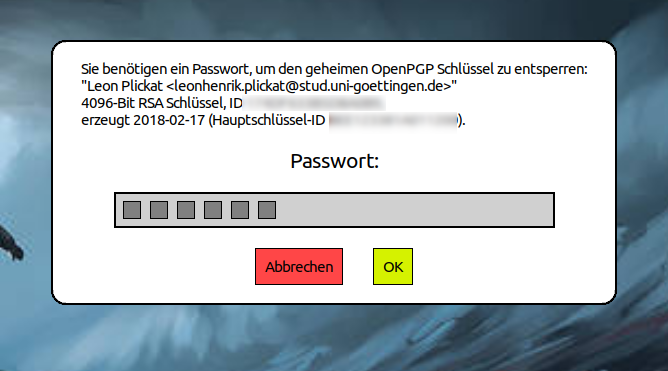

# wayprompt



Wayprompt is a multi-purpose (password-)prompt tool for Wayland.
Also has a TUI fallback mode for when no wayland connection can be established,
like when invoked while using a TTY.

Requires the compositor to support the layershell.

Wayprompt ships multiple executables:

* `wayprompt`: CLI prompt tool.
* `pinentry-wayprompt`: drop-in pinentry replacement, for example for gpg.
* `wayprompt-ssh-askpass`: ssh-askpass implementation, for use with ssh and
  programs that wrap it, like git and rsync.

All executables use the same configuration file, read `wayprompt.5` for details.

Read the man pages of the different versions to learn how to set them up.


## Building

Wayprompt is developed against zig version 0.11.0 and depends on lib-wayland,
xkbcommon and pixman.

```sh
git clone https://git.sr.ht/~leon_plickat/wayprompt
cd wayprompt
git submodule update --init
zig build -Doptimize=ReleaseSafe --prefix ~/.local/ install
```


## Bug Reports & Contributions

Please send all bug reports and patches to
[~leon_plickat/public-inbox@lists.sr.ht](mailto:~leon_plickat/public-inbox@lists.sr.ht).


## License

wayprompt is licensed under the GPLv3.
